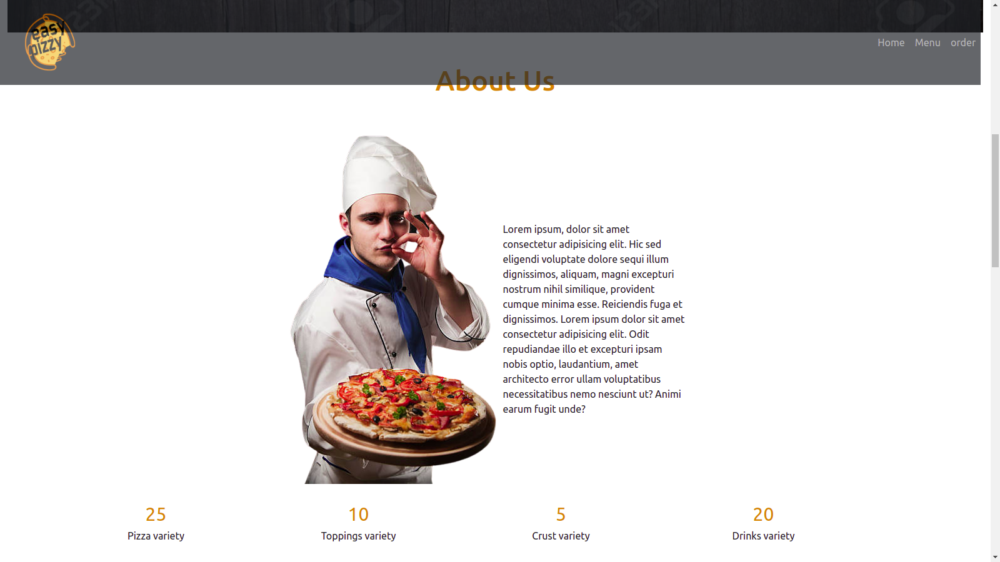
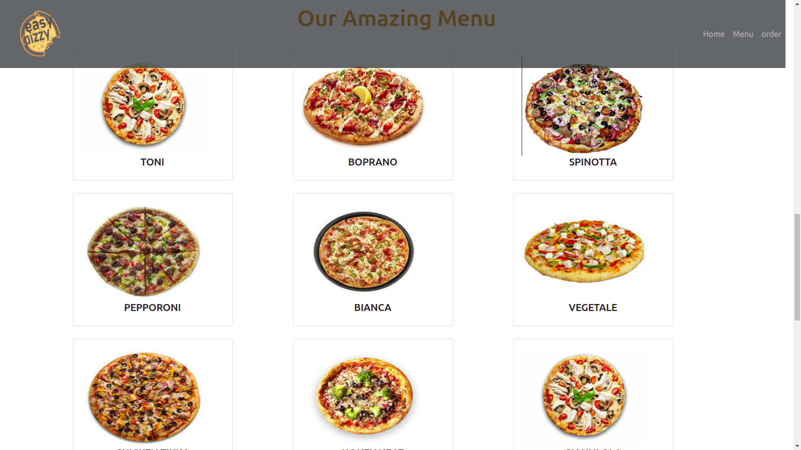
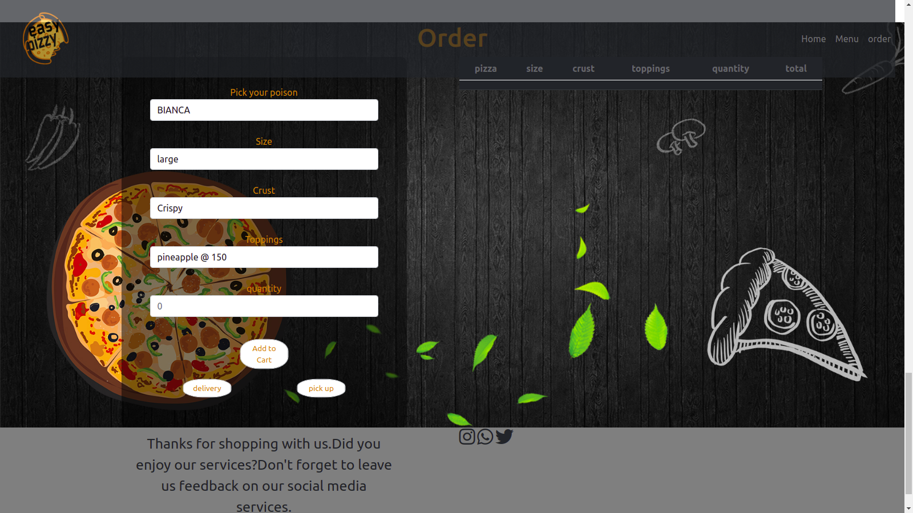

# Easy Pizzy
#### This is an HTML  JS project for a Pizza shop, 2021
#### By **Moses Kings**
## Description
Easy pizzy is Pizza place website application that customers use to pizza orders online and get them delivered to them.customers can also get pizza to be prepared and go for the ready made pizza.The site has easy pizzy menu and the services we perform.
## Setup/Installation Requirements
* Fork/Clone the repository
```
https://github.com/MosesGakuhi1857/Easy-pizzy.git
```
* Open your project on your favorite editor
* Open project on Live Server
## Known Bugs
No known bugs
## Technologies Used
1. HTML
2. CSS 
3. Javascript
4. jQuery
5. bootstrap
## Support and contact details
If you have any issue, want to contribute to the code, have question? Contact me via
+254798015111
## screenshot of the page






### License
[MIT](https://choosealicense.com/licenses/mit/)
Copyright (c) 2021, Moses Gakuhi